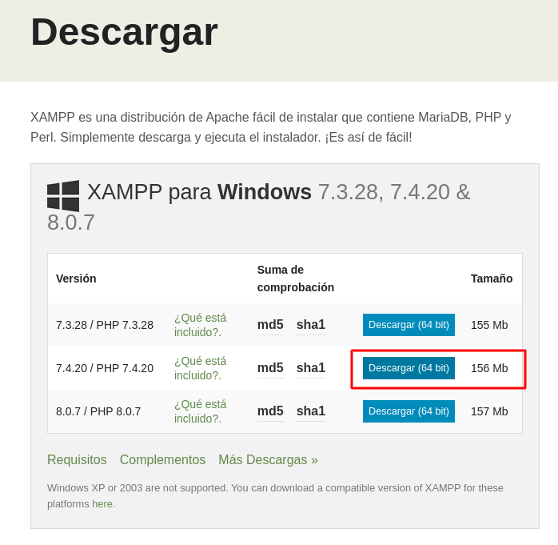
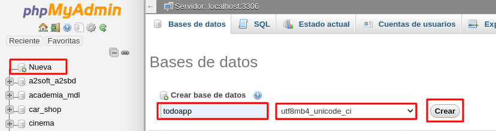

## About this ToDoBack

This project is builded with Laravel 7

Is a basic API rest project to work with the [ToDo App](https://github.com/brayanibp/todoapp) project.

## Installing Pre-dependencies

The first thing that will have to do is to install dependencies.

### Installing on Windows

For you should be enough just to download and install [xampp](https://www.apachefriends.org/es/download.html) with the PHP 7.4 version as the remarked below



And later install [composer](https://getcomposer.org/doc/00-intro.md#installation-windows) with the instructions in [this link](https://getcomposer.org/doc/00-intro.md#installation-windows).

Once installed you should download the project the inside `c:\xampp\htdocs` folder and start xampp from the xampp panel controller

To see [how to download and install the project](#installing_the_project) follow the next steps

### Installing on Linux

#### Ubuntu

You should use the below commands

```
  sudo apt update   #This will update the apt repos
```

```
  sudo apt install apache2   #This will install apache server
```

```
  sudo apt install mysql-server #This will do a basic installation of mysql server
```

```
  sudo service apache2 start && sudo service mysql start #This will start apache and mysql server
```

Now to install the 7.4 PHP version

```
sudo apt update

#FOR UBUNTU 20.04

sudo apt install -y php php-cli php-fpm php-json php-common php-mysql php-zip php-gd php-mbstring php-curl php-xml php-pear php-bcmath

## You shoud run to see if it is all ready

php --version

#FOR UBUNTU 18.04

sudo apt -y install software-properties-common
sudo add-apt-repository ppa:ondrej/php
sudo apt-get update
sudo apt install -y php7.4 php7.4-fpm php7.4-json php7.4-curl php7.4-bcmath php7.4-bz2 php7.4-intl php7.4-gd php7.4-mbstring php7.4-mysql php7.4-zip php7.4-common php7.4-pear
```

## <a name="installing_the_project"></a> Installing the project

To install the project first you have to clone the repo with

```
  git clone https://github.com/brayanibp/todoback.git
```

After that you should enter in the project folder and run:

```
composer install -vv
```

Depending on your internet connection it would take a while because of that it prefer to use `-vv` or `-vvv` flags with slow connections it gives more feedback

After install composer dependencies

```shell
# Commands to pre config project

php artisan key:generate
php artisan config:cache

```

```shell
# If you do not have password for mysql database

mysql -u root

# If you already have a password then

mysql -u root -p #You will have to enter your root password

#Once inside mysql client you will write

mysql> CREATE DATABASE db_name CHARACTER SET utf8mb4 COLLATE utf8mb4_unicode_ci;

mysql> exit;
```

### Note:

If you have phpmyadmin you would try to do it from the phpmyadmin panel



Now the last steps

```shell

php artisan migrate:fresh --seed #This command will make the tables migration and execute the database tasks seeder

```

## How to run

After all the install process you will be available to run

```shell

php artisan serve

```

This command will expose the project on [localhost:8000](http://localhost:8000/) by default.

### Note:

The [http://localhost:8000/](http://localhost:8000/) route is disabled and will send you to a 404 screen

## Available routes

### `get` http://localhost:8000/tasks/single/{id}

### `get` http://localhost:8000/tasks/{filter}

http://localhost:8000/tasks/all

http://localhost:8000/tasks/completed

http://localhost:8000/tasks/uncompleted

### `get`http://localhost:8000/tasks/{filter}/{arg}

http://localhost:8000/tasks/name/{arg}

(The "arg" word refers to "argument" and in the case of the path it refers to the name of the task being searched for)

### `post` http://localhost:8000/tasks/

Path used to create a new task into database

### `put` http://localhost:8000/tasks/{id}

Path used to update a task by ID

### `delete` http://localhost:8000/tasks/{id}

Path used to destroy or delete a task from the database by ID

## License

I have used the default Laravel License

The Laravel framework is open-sourced software licensed under the [MIT license](https://opensource.org/licenses/MIT).
